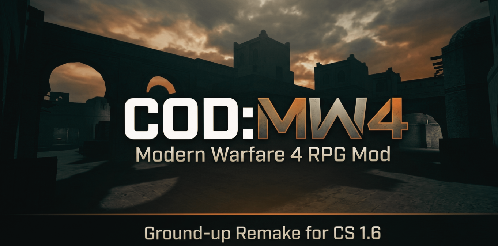

# COD:MW4 - Modern Warfare 4 RPG Mod for Counter-Strike 1.6

COD:MW4 is a ground-up remake of the classic COD Mod RPG for Counter-Strike 1.6, built from scratch for AMX Mod X 1.9.

## Project Status

| Phase | Status |
|-------|--------|
| Phase 1: Planning & Documentation | COMPLETE |
| Phase 2: Core Development | IN PROGRESS |
| Phase 3: Testing | NOT STARTED |
| Phase 4: Public Launch | NOT STARTED |

## Gameplay Features

- Level system: 1 to 250 plus Mastery 1 to 250
- Five attributes: Intelligence, Strength, Stamina, Condition, Fortune
- Four classes: Sapper (Free), Assassin (VIP), Ghost (Credit), Chronos (Custom)
- Four perks: Silent Boots, Quick Reload, Immortality, Set Stunter
- Shop with 9 items including Kulawangsa Shield
- Streak system: Daily, Weekly, Kill, Round, Quest
- Gap protection with 5 stacks for fair PvP
- Cosmetic system: 9 kill effects and 5 custom knives (permanent)
- 100 kevlar and helmet every spawn
- Unlimited BP ammo
- Press M for main menu
- Scrolling HUD
- 40 sound effects

## Technical Specifications

| Aspect | Specification |
|--------|---------------|
| Platform | AMX Mod X 1.9.0 |
| Database | SQLite (sync blocking only) |
| Target Hardware | Pentium 4, 1GB RAM, Intel GMA 950 |
| Coding Style | 4-space indentation, braces on new line for functions |

## Team Recruitment

We are building a team to complete this project.

### Open Positions

| Position | Quantity | Priority |
|----------|----------|----------|
| Programmer | 5 | Critical |
| Hoster | 1 | Critical |
| Tester | 20 | High |
| Discord Moderator | 3 | Medium |
| Promoter | 5 | Low |

### Programmer Requirements

- Must be fluent in PAWN language for AMX Mod X
- Must understand fakemeta, hamsandwich, and SQLite modules
- Must speak English for team communication
- Must have proven experience (submit sample code or previous work)
- Must sign a confidentiality agreement

**CRITICAL RULE FOR PROGRAMMERS:**

No programmer may share any code with anyone outside the programmer team. Only El (project lead) and all programmers have access to view and edit code. Sharing code with any external party results in immediate removal from the team and legal action if necessary.

### Hoster Requirements

- Must provide a dedicated Counter-Strike 1.6 server
- Server must run 24/7 with minimum 95% uptime
- Server specifications: minimum 2GB RAM, stable internet connection
- Must grant El and programmers full FTP or file access to add, remove, or modify files
- Must not modify any game configuration without approval
- Must keep server free from other mods that may cause conflicts

### Tester Requirements

- Must own or have reliable access to Counter-Strike 1.6
- Must be able to play at least 5 hours per week on the test server
- Must follow bug reporting format (template available on Discord)
- Must not exploit bugs for personal gain
- Must report bugs honestly without withholding information

### Discord Moderator Requirements

- Must be fluent in English
- Must be active on Discord at least 10 hours per week
- Must understand and enforce server rules
- Must not abuse moderation permissions
- Must resolve conflicts professionally

### Promoter Requirements

- Must be active on gaming forums, Discord servers, or social media
- Must invite potential players to the Discord server
- Must not spam or use aggressive marketing tactics
- Must report weekly promotional activities

## Benefits for Team Members

All team members receive the following benefits:

### Full Access After Server Launch

Once the public server is launched, all team members receive permanent full access to all VIP features and premium content on the server at no cost.

### Revenue Sharing

- Programmers: Share of donation and VIP sales revenue
- Hoster: Share of donation and VIP sales revenue (on top of server access)
- Testers: Share of donation revenue
- Discord Moderators: Share of donation revenue
- Promoters: Share of donation revenue based on referral tracking

Revenue distribution percentages will be documented and shared with all team members before launch.

### Recognition and Credit

- All team members listed in CONTRIBUTORS.md
- Programmers credited in code headers
- Testers acknowledged in launch announcement
- Names included in server MOTD

### Experience

- Work on a complete game modification project
- Learn AMXX 1.9 programming
- Join a professional team environment
- Portfolio reference for future opportunities

## Server Access Levels After Launch

| Role | Access Level |
|------|-------------|
| El (Project Lead) | Owner |
| Programmer | BOSS |
| Hoster | BOSS |
| Tester | VIP plus Junior Admin |
| Discord Moderator | VIP plus Senior |
| Promoter | VIP |

## How to Apply

Join our Discord server: https://discord.gg/ZaGdCPGWzd

Post in the recruitment channel with the following information:

1. Your Discord username
2. Position you are applying for
3. Your experience (relevant to the position)
4. How many hours per week you can commit
5. Why you want to join this project

For programmer applicants: You will be asked to provide a code sample or complete a small technical test.

## How to Request Features or Report Issues

Simply join the Discord server and create a ticket. The team will review your request.

## Code Access Policy

Only El (project lead) and approved programmers have access to view and edit the source code.

No other team member or external party has access to the code.

Programmers are strictly forbidden from sharing any code with anyone outside the programmer team.

This policy protects the integrity and ownership of the project.

## Repository Structure
COD-MW4/
├── README.md
├── LICENSE
├── CONTRIBUTING.md
├── CODE_OF_CONDUCT.md
├── docs/
│ ├── specifications/
│ └── english/
├── include/
│ └── cod.inc
├── .github/
└── CONTRIBUTORS.md

text

## Disclaimer

COD:MW4 is a ground-up remake inspired by the gameplay concepts of COD Mod Legacy (created by O'Zone).

No code was copied from the original mod. All implementations are original and written from scratch.

This project is not affiliated with or endorsed by O'Zone.

Credit and respect to O'Zone for creating the original COD Mod that inspired this project.

## Contact

| Role | Contact |
|------|---------|
| Project Lead | from_indonesia |
| Discord Server | https://discord.gg/ZaGdCPGWzd |
| GitHub Repository | https://github.com/amxxscripter412-hub/COD-MW4 |
